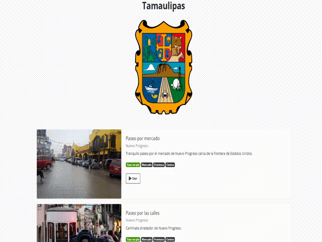

# mexico-map-tours

A Django website to show many places in Mexico using walking/car video tours. It's 80% complete (just needs filters) but lost motivation to continue project so feel free to use any code.

It includes:
- 32 states with its respective wikimedia commons attributes and SVG files.
- Selecting a state through an SVG map of mexico.
- Categories and tags.

